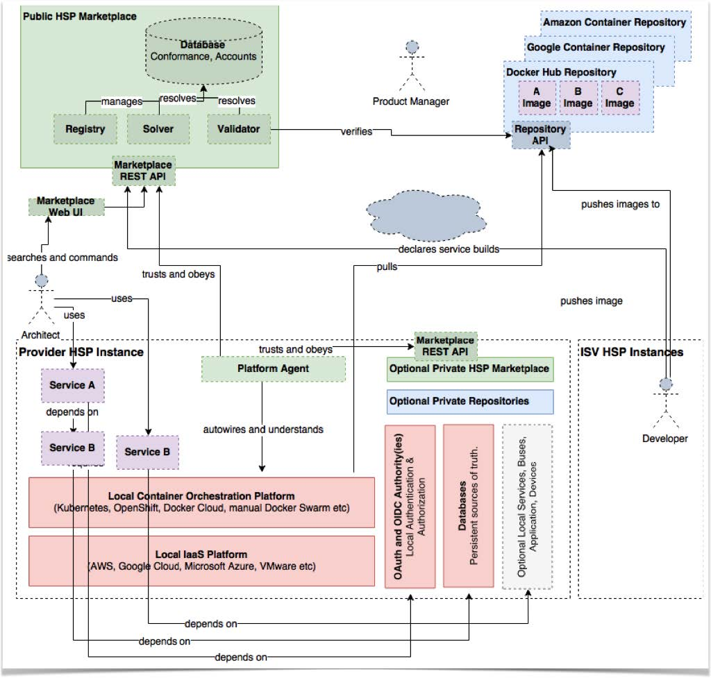
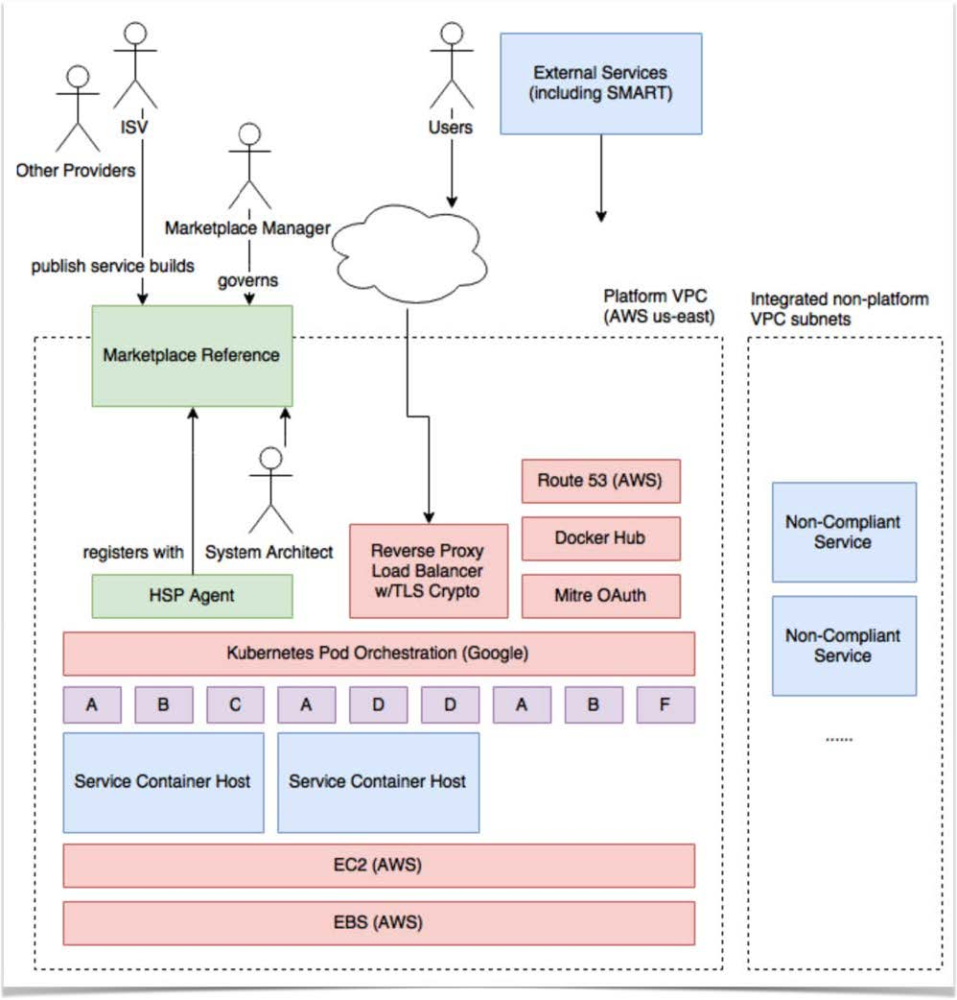

# Consent Services using FHIR - Implementation Guide
  - Decision Service
  - Enforcement Service
   
## HL7 Title
## Title page
## Important Notes
*Boilerplate license text* 
## Acknowledgements
*ONC Leap project*
## Table of Contents
## Introduction and Need 
*Provide basic problem statement and justification*
## Core Concepts
### Summary
### Motivation
### For Developers and Integrators 
*Concepts of specific concern to implementors*
### For Adopter
*Concepts of specific interest to user and organizations using this techology*
## Functional Service Models
*High level description of the services and and how they relate*
*Diagrams here would be good - Some examples*

### Overview of Consent
### What is a Decision Service
### What is an Enforment Service
### Other Actors
## API
*We may want to cover the API for each service seperately
### Platform independent model

*We will want to cover this in a way that makes sense for what we have*
### FHIR platform model
#### Releationship to FHIR
**Possible areas to cover**
- CDS Hooks
- Access control
- Services, Builds, and Images
- Standards compliance declarations
- Configustion State tracking
- Common Concepts between resources
- REST operations
- Endpoints Overview
- Normal vs Management endpoints
- Security of the service
- Audit access
### Endpoints (In Detail)
*Resource templates and resource specific notes for each type
---
*Examples endpoint sections, repeat as required
#### Name of Service1 (/Service1 URL)
*Details of the service*
*Resource Description*
#### Name of Service2 (/Service2 URL)
*Details of the service*
*Resource Description*
--
## Appendix - Machine readable models and the like
## Appendix - Related Standards
### CDS Hooks
## Appendix - Examples
 